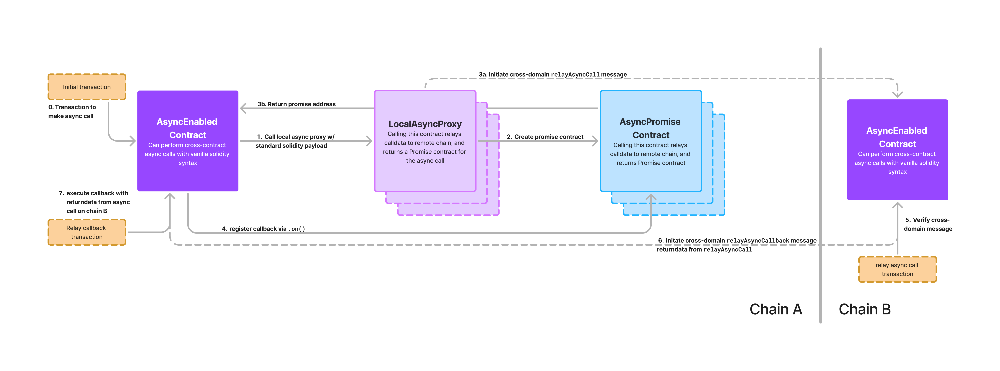

# Async Superchain Library

This library provides an abstraction for asynchronous function calls across interoperating L2s. It introduces an async/promise pattern to handle cross-chain interactions, compatible with vanilla Solidity syntax.

## Overview

### Key Contracts
1. **AsyncEnabled.sol**: This contract contains the main inheritable logic for initiating and handling asynchronous calls. It manages the creation of local async proxies and relays async calls and callbacks.

2. **LocalAsyncProxy.sol**: A local proxy representing a contract on a remote chain which can be called with standard Solidity function calls. It handles the creation of async calls and returns a promise contract that will eventually trigger a callback with the return value of the remote async call. By using local proxies, we can make async calls with **vanilla Solidity syntax, no custom encoding or messaging functions.**

3. **AsyncPromise.sol**: Represents a promise that tracks the state of an async call on an initiating chain. Contracts which create promises can attach callbacks via `.on` to be executed once the async call is executed on the remote chain. The arguments of a callback function must match the return values of the async call which created the promise.

### Contract "Promification" Pattern

The basic pattern these contracts implement is to convert functions which are labelled with the `async` keyword into functions which return a `Promise` contract.
For example, consider the following Solidity function:
```solidity
contract MyContract {
    function myAsyncFunction() external async returns (uint256, bytes32) {
        // ...
    }
}
```
We can use this to define a Promise contract, with a single method, `on(...)`, which accepts a callback function. The callback function must take the same arguments as the async function's return values.
```solidity
interface myAsyncFunctionPromise {
    function on(function (uint256, bytes32) external) external;
}
```
We can then define a "remote" interface for the asyncEnabled contract, which returns promise contracts for all of its async functions.
```solidity
interface MyContractRemote {
    function myAsyncFunction() external returns (myAsyncFunctionPromise);
}
```
To initiate an async call, we can deploy cast a `LocalAsyncProxy` contract to the remote interface and call the async function. `AsyncEnabled` contracts have a `getAsyncProxy(address _remoteAddress, uint256 _remoteChainId)` method which returns the address of the local proxy for the given remote contract, deploying if necessary.

```solidity
MyContractRemote remote = MyContractRemote(this.getAsyncProxy(remoteAddress, remoteChainId));
remote.myAsyncFunction().on(this.myCallback);
```
#### Interface Generator
For convenience, this repo contains a ⚠️VERY JANKY, WIP⚠️ implementation of an interface generator for promise contracts. Running `just promify MyContract` will generate the `MyContractRemote` interface in `src/interface/async` and add an import line to `MyContract.sol`. Use at your own risk!

## Example Async Contract

The [`ExampleAsyncEnabled.sol`](./src/ExampleAsyncEnabled.sol) file contains a simple AsyncEnabled contract with a single async function. When deploying, you can specify a return value for `myAsyncFunction1`. The function `makeAsyncCallAndStore` will make an async call to this function on another chain, and store the return value in `lastValueReturned` when the callback is triggered. The [`test/ExampleAsyncEnabled.spec.ts`](./test/ExampleAsyncEnabled.spec.ts) file contains a simple test for the contract.

## Explainer Diagram
Here is the rough anatomy of an async call under the hood:


## Installation
### Prerequisites
```
git clone --recurse-submodules git@github.com:ben-chain/superchain-async.git
```

- This repo uses a Supersim binary, see installation guide [here](https://supersim.pages.dev/getting-started/installation).
- This repo was built using `yarn` and Node v18.
- This repo uses [just](https://github.com/casey/just) to manage test commands build steps. Install just by following the instructions [here](https://github.com/casey/just#installation).
- This repo uses [foundry](https://github.com/foundry-rs/foundry) to manage builds and do unit tests. Install foundry by following the instructions [here](https://book.getfoundry.sh/getting-started/installation).
### Building and running
```
# Build the contracts
just build
# Unit tests for AsyncEnabled contracts
just test-forge
# Integration tests for ExampleAsyncEnabled
just test-viem
```